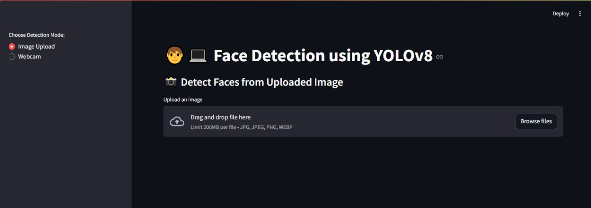
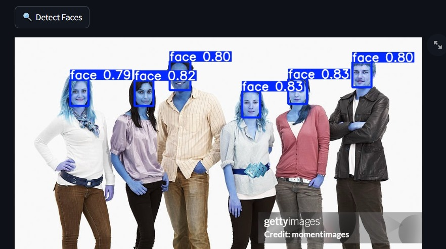
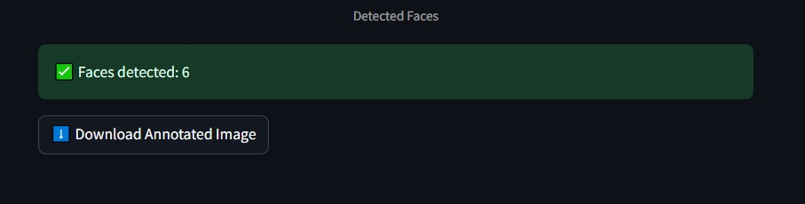
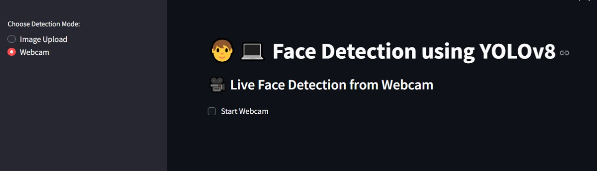

# Face Detection App using YOLOv8 & Streamlit

Real-time Face Detection application built with YOLOv8, OpenCV, and Streamlit.

This project allows detecting faces from both uploaded images and live webcam feed with an easy-to-use web interface.

------

## 📝 Description

This project leverages the power of YOLOv8 (Ultralytics) for robust face detection.
It is designed to be lightweight, efficient, and user-friendly with a modern Streamlit dashboard.

### 🔍 Key Features

1.**Image Upload Detection**: Upload any image, and the app detects faces with bounding boxes.

2.**Webcam Detection**: Detect faces in real-time from your webcam.

3.**Face Count**: Shows the number of detected faces.

4.**Download Results**: Option to download annotated images with detected faces.

5.**Simple UI**: Powered by Streamlit for interactive use.


------

## 🚀 Built With

### 📌 Languages

* 


### 🧰 Libraries & Frameworks

* Face detection
* Image processing
* Web app
* Numpy – Array & image operations
* PIL (Pillow) – Image handling

-----

## 🛠️ Getting Started

### ✅ Prerequisites

- Python 3.8+
- pip for installing packages
- Git (for cloning the repo)

## 🔧 Installation

```bash
git clone https://github.com/niyatipatel2005/Face-Detection-Using-YOLO.git
cd Face-Detection-Using-YOLO
pip install -r requirements.txt
```

## 📊 Running the Project
1. Launch the Web App
```bash
streamlit run app.py
```

Then open http://localhost:8501
 in your browser.


 ----


 ### 🖼️ Dashboard Screenshot




### 📁 Project Structure

```bash
face-detection-app/
│
├── app.py                           # Streamlit app
├── main.py                          # CLI interface (optional)
├── models/
│   └── yolov8n-face.pt              # YOLOv8 pre-trained face model
├── outputs/                         # Annotated images & cropped faces
├── utils/
│   ├── detect_faces_from_image.py   # Image detection
│   ├── detect_face_from_webcam.py   # Webcam detection
│   └── save_faces.py                # Save cropped faces
├── requirements.txt
└── README.md
```

### Output Images:





-----



## Authors

* Niyati Patel  -  https://github.com/niyatipatel2005


## License

This project is licensed under the [NAME HERE] License - see the LICENSE.md file for details

## Acknowledgments

Special thanks to:

- Ultralytics YOLOv8 for the pre-trained model.
- Streamlit for the interactive UI framework.
- OpenCV & PIL developers for computer vision utilities. 
- The open-source community for making tools accessible.
